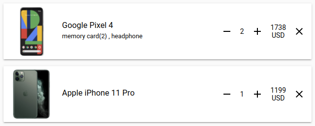
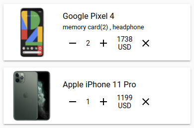

[](https://www.webcomponents.org/element/owner/my-element)
# \<wise-shopping-cart\>

Responsive shopping cart

### It contains:
- image
- name 
- quantity 
- price 
- increase/decrease quantity buttons 
- remove item from cart button 

### Desktop view


### Mobile view


# How to run

## Install the Polymer-CLI

First, make sure you have the [Polymer CLI](https://www.npmjs.com/package/polymer-cli) and npm (packaged with [Node.js](https://nodejs.org)) installed. Run `npm install` to install your element's dependencies, then run `polymer serve` to serve your element locally.

## Viewing Your Element

```
$ polymer serve
```

# How to use

You can see usage in `demo-wise-shopping-cart.js`

To initialize use this JSON to fill values:
```
<wise-shopping-cart cart-items="[[cartItems]]"></wise-shopping-cart>

[
    {
        "uuid": "8",
        "name":"Google Pixel 4",
        "imagePath":"demo1.jpg",
        "quantity":"1",
        "price":"25999"
    },
    {
        "uuid": "16",
        "name":"Apple iPhone 11 Pro",
        "imagePath":"demo2.jpg",
        "quantity":"1",
        "price":"25999"
    }
]
```
There are three events available: 
- `increase-item-quantity`
- `decrease-item-quantity`
- `remove-item`

```
document.addEventListener('remove-item', function (e) {
   console.log("removeItem:", e.detail);
})
document.addEventListener('decrease-item-quantity', function (e) {
   console.log("decreaseItemQuantity:", e.detail);
})
document.addEventListener('increase-item-quantity', function (e) {
   console.log("increaseItemQuantity:", e.detail);
})
```